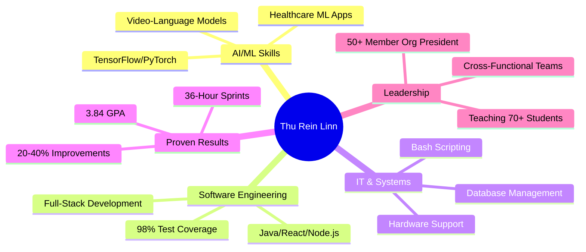

  

  
# 👋 Computer Science Student @ Drexel University

### 🎯 Seeking Spring/Summer 2026 Co-op (6 months)

**GPA: 3.84** | Dean's List | STAR Scholar | Expected Graduation: June 2029

---

## 🎯 Open to Co-op Roles (Mar 2026 - Sept 2026)

| 🤖 **AI/ML & Data Science** | 💻 **Software Engineering** | 🔧 **IT Support & Systems** |
|:---|:---|:---|
| • AI/ML Developer | • Full-Stack Developer | • IT Support Specialist |
| • Data Scientist | • Software Engineer | • Systems Administrator |
| • Machine Learning Engineer | • Backend Developer | • Database Administrator |
| • Data Analyst | • QA/Test Engineer | • Technical Support |
| • Research Scientist | • Java Developer | • Digital Production Designer |

**📍 Location:** Philadelphia, PA (Open to remote & relocation)  
**💼 Work Authorization:** US Authorized  
**⏰ Availability:** 6-month commitment (Mar - Sept 2026)

---

## 💡 What I Bring

<table>
<tr>
<td width="25%" align="center">
  
### 📊 Proven Impact
**20-40%** efficiency gains  
across all roles

</td>
<td width="25%" align="center">
  
### 🚀 Fast Execution
Built production apps  
in **36-hour** sprints

</td>
<td width="25%" align="center">
  
### 🏆 Academic Excellence
**3.84 GPA**, Dean's List  
First Place IEEE Winner

</td>
<td width="25%" align="center">
  
### 👥 Leadership
President of **50+ member**  
tech organization

</td>
</tr>
</table>

---

## 🛠️ Technical Skills

### Languages

### AI/ML & Data Science

### Web & Software Development

### Tools & Platforms

---

## 💼 Experience Highlights

<table>
<tr>
<td width="33%">

### 🧠 ML Research
**Algoverse AI**  
Jun 2025 - Present

Video-language modeling  
Benchmarked on YouCook2  
PyTorch, TensorFlow

</td>
<td width="33%">

### 💻 Software Dev
**UPenn Neuroscience Lab**  
Oct 2025 - Present

Full-stack platform  
30+ participants  
**20% accuracy boost**

</td>
<td width="33%">

### 🔧 IT Support
**Drexel TechServ**  
Jan 2025 - Present

Refurbished 15 PCs  
Genius Bar support  
Hardware troubleshooting

</td>
</tr>
</table>

<table>
<tr>
<td width="33%">

### 📊 Data Analysis
**ThinkNeuro**  
Sep - Dec 2025

R pipeline, 200+ papers  
Statistical analysis  
Identified **15% decline**

</td>
<td width="33%">

### 🎓 Teaching
**Drexel CS570 TA**  
Sep 2025 - Present

20+ grad students  
Python mentoring  
**10% improvement**

</td>
<td width="33%">

### 🔬 Research
**STAR Scholars**  
Jun - Aug 2025

Python simulations  
**88-90% accuracy**  
100 virtual agents

</td>
</tr>
</table>

---

## 🚀 Featured Projects

| Project | Technologies | Impact |
|---------|-------------|--------|
| **🏥 [NexaHealth](https://github.com/thureinlinn-gif/NexaHealth-Project)** - ML Wound Assessment | TensorFlow, Python, OpenCV | Hackathon winner, VC pitch |
| **🧘 [MindEd](https://github.com/thureinlinn-gif/MindEd)** - Mental Wellness AI | React, TypeScript, Gemini API | 0-100% health scoring |
| **🏦 Banking System** - Java Application | Java, JUnit, OOP | 98% line coverage, 300+ tests |
| **🗺️ Pizza Map** - Interactive Web App | JavaScript, Google Maps API | 35% discoverability increase |
| **💾 Grades Database** - C Programming | C, Data Structures, Valgrind | Command-line CRUD system |
| **📁 Directory Indexer** - Bash Automation | Bash, JSON, jq | System admin tool |

---

## 🏆 Recognition

🥇 **First Place** - IEEE Scratch Competition (Oct 2024)  
🎓 **Dean's List** - Spring 2025  
🔬 **STAR Scholar** - Research Grant Recipient  
🎖️ **Honors Program** - Drexel University  

---

## 📊 GitHub Activity

  

---

## 🎯 Why Recruit Me?

---

## 📈 What Employers Say

> *"Improved data accuracy by 20% and streamlined our research workflows"* - **UPenn Neuroscience Lab**

> *"Boosted student comprehension by 10% through clear technical communication"* - **Drexel University**

> *"Built production-ready system with 98% code coverage"* - **Software Engineering Project**

---

## 🌟 Currently

<table>
<tr>
<td width="33%" align="center">

### 👨‍💼 President
Drexel Society of  
Computational Neuroscience  
*50+ members*

</td>
<td width="33%" align="center">

### 📊 Analyst
Drexel Consulting Group  
*Business analytics*

</td>
<td width="33%" align="center">

### 👨‍🏫 Teaching Assistant
CS570 Graduate Course  
*20+ students*

</td>
</tr>
</table>

---

## 📫 Let's Connect!

### 🚀 Ready for Spring/Summer 2026 Co-op 🚀

**6-Month Commitment** | **March 2026 - September 2026** | **Full-Time (40 hrs/week)**

**📍 Based in Philadelphia, PA** | **Open to Remote & Relocation**  
**💼 US Work Authorization** | **🎓 Graduating June 2029**

---

### 💼 Open Roles I'm Targeting

**AI/ML:** AI Developer • ML Engineer • Data Scientist • Research Scientist  
**Software Engineering:** Full-Stack Developer • Backend Engineer • Software Engineer • QA Engineer  
**IT/Systems:** IT Support Specialist • Systems Administrator • Database Administrator • Technical Support

*Interested in discussing opportunities? Let's talk!*

---

### ⚡ Quick Stats

---

**"Turning complex problems into elegant solutions, one line of code at a time."**

